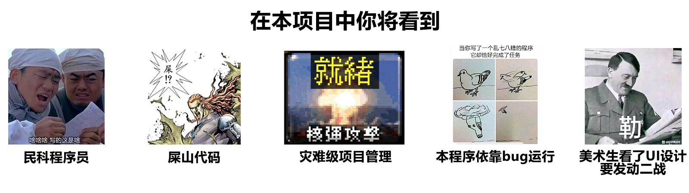
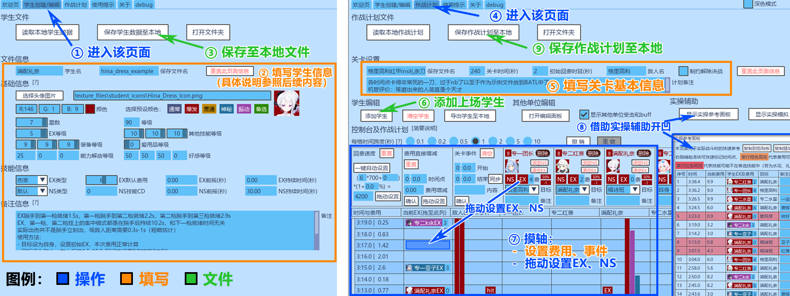
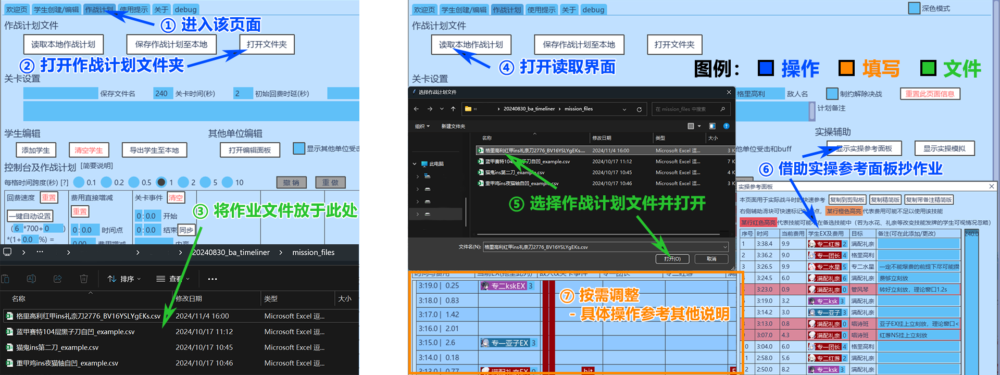

# BA TimeLiner

## BATL摸轴工具，来助你成为总力战高手

### [BATL v0.10.9(beta) 下载](https://github.com/giga-35b/BA_TimeLiner/raw/refs/heads/main/download/BATL_v0.10.9_beta.zip)

<!-- 
### —— 警告 ——
在本项目中你将看到包括但不限于以下内容：

- 没接受过专业训练的民科程序员
- 堆了两个多月的屎山代码
- 灾难级别的项目管理与开发计划
- 基于bug来运行的神必程序
- 美术生看了要发动二战的ui设计

民科程序员 屎山代码 灾难级管理 bug 美术生看了要发动二战.jpg
-->

**README施工中......**

**本工具还未正式发布，欢迎你成为内测用户！若需要反馈bug/提出建议，请直接联系作者qq2268590258**

----------

## 工具简介

本工具的适用对象包括但不限于：总力战、大决战、制约解除决战等战斗

本工具的功能包括但不限于：

- 摸轴（制定战斗计划）
	- buff区间显示
	- 费用自动计算
	- 事件提示
- 实操辅助
	- EX释放参考
	- 实战模拟
- 作业导入/导出

**本说明文件的所有配图不一定是在BATL的最新版本中截取，请以实际版本为准**

----------

## 快速入门

### 自行摸轴

1. （可选）在“学生创建/编辑”页中创建或编辑学生，并保存至本地(对应下图中①②③)
2. 在“作战计划”页中输入关卡敌人数据，并选择上场学生(下图中④⑤⑥)
3. 摸轴，参考页面上各信息，根据需要进行添加ex、添加ns、设置费用等操作(⑦)
4. 参照页面上的计划和实操辅助在游戏内开票凹总力(或其他战斗)，或导出作战计划至.csv文件(⑧⑨)

注：建议先在游戏内模拟并摸清ns轴和事件轴并填入计划，再开始规划ex轴

### 作业导入

1. 预先在本地准备好作业（作战计划文件，.csv格式）(对应下图中①②③)
2. 在“作战计划”页中打开作业数据文件(下图中④⑤)
3. 抄作业，参照页面上的计划和实操辅助在游戏内开票凹总力，或根据需要对其进行修改(⑥⑦)

**你可以继续往后阅读详细功能介绍，也可以直接在工具中自行摸索**

----------

## 详细功能介绍

### 学生编辑

- 学生文件读取/保存
- 基础数据
- 学生头像
- 技能信息

### 作战时间轴

- 作战计划文件读取/保存
- 关卡信息设置
- 添加学生和其他单位
- 设置费用轴
- 设置关卡事件
- 设置EX技能和NS技能
- 制约解除决战
- 实操参考（EX释放参考面板）
- EX轴复制分享
- 实操模拟

### 其他

- 深色模式
- 反馈与建议
- 高级（debug页面）

----------

## 使用提示

### 可能用到的缩略词/黑话一览（包括但不限于本工具内）

- BATL： Blue Archive TimeLiner，即本工具（BATL摸轴工具）
- CD、前摇：  冷却时间（Cool Down）、技能释放到实际生效的时间
- EX、NS、PS、SS： 大招、普通技能、被动技能、支援技能，分别对应学生的技能栏第1-4栏
- buff、db(debuff)、CC：效果（通常指正面增益效果）、负面减益效果、控制（Crowd Control，人群控制）
- 正手拐：先上buffEX，再放输出EX，常规输出流程
- 反手拐：先放输出EX，再上buffEX，利用大部分时候输出EX前摇大于buff EX前摇的特点，在不太损失或不损失本轮输出EX伤害的情况下，更早过牌到下一张输出EX，达到一次buff持续时间内打出两次输出EX的效果。通常对手速要求较高，需要紧凑设置EX时间

### 别急，不然有你急的（指等加载）

- 刚打开BATL.exe时有5-10s的加载时间，此时窗口处于无响应状态
- 请不要在这个时候拖动窗口，否则有较高概率导致程序卡死
- 若确实因为包括上述原因在内的各种原因卡死了，请重启BATL.exe
- 希望你没有因此损失什么工作量，以及建议养成勤保存的习惯:D

### 一切以方便为优先

- 使用本工具时切记：一切以方便优先
- 你可以视情况决定是否使用某个功能或填写某个字段
- 比如设置技能时可以不设置目标（即默认以自身为目标），只要看buff时自己能看懂（知道是某目标挂上了buff）就行
- 比如“学生创建/编辑”中的技能前摇等字段，除非对时间有严格要求，否则也可以留空不填

### 学生文件和作战计划文件没有联动

- “学生创建/编辑”和“作战计划”是互相独立的两个页面，内部信息不共通
- 也就是说用户需要在“学生创建/编辑”中创建学生并保存至文件，然后在“作战计划”中读取该文件

### NS需要自行依情况设置

- 虽然学生技能信息中包含NScd，但本工具并不提供自动设置NS的功能
- 因为NS具体触发时间受很多因素影响（主要是前排的NS），包括位移、平a、换弹、EX、CC、索敌等
- 建议在游戏中实操看看NS的触发时间，再在BATL作战计划里设置NS，并且注意这个只是大致时间，请留足余量

### 别高估自身手速

- 一般用户（包括手机平板用户）建议每两个EX技能间隔都不短于0.5秒，以提升容错
- 制约解除决战中，考虑到操作难度和本工具性能，建议每两个EX技能间隔都不短于1秒，并将每格时间跨度设为不短于1s
- 一般情况下，在模拟器上手操不使用AUTO时，2个EX技能的释放间隔难以短于0.2秒，3个为0.5秒，4个为1.0秒（因为要等第四个EX显示出来后才能选定释放）
- 除非确有需要，同时用户对手速有自信且有设置键位映射，否则不建议计划以上述极限间隔甚至短于上述极限间隔设置EX技能

### 关于文件管理

- 学生文件和作战计划文件都有对应的默认保存/读取文件夹（./student\_files/ 和 ./mission\_files/）
- 理论上这些文件放哪都行，但最好还是放在对应文件夹，防止自己找不到或不小心移动位置
- 头像等材质文件也有默认的读取文件夹./texture\_files/，同理，建议都放到这里

### 一些建议避免的点炒饭行为

- 在文本输入框输入双引号、单引号、逗号、反斜杠等（均指英文字符）可能会造成错误识别的字符
- 在上一次操作后时间轴刷新未结束时，直接进行下一次操作
- 直接手动修改学生文件和关卡计划文件，并改变其格式或结构（并不是不能改，但你需要知道你在改什么，并且修改前请备份）

注：

- “点炒饭”梗出自一个程序员笑话，感兴趣的可以去搜
- 这里“点炒饭”指用户各种出乎意料的神奇操作，能从各种刁钻的角度让程序崩溃
- 因个人精力有限，作者并不可能去仔细考虑所有点炒饭的操作并设置处理方法，因此只能希望用户不要作死去尝试过于神奇的操作
- 当然，如果你确实想点炒饭，作者也不可能拦着，但可能会造成崩溃导致编辑内容未保存等后果
- 如果你觉得某个操作不应该导致程序崩溃但程序确实崩溃了，请联系作者反馈

<!--
一个测试工程师走进一家酒吧，要了一杯啤酒
 一个测试工程师走进一家酒吧，要了一杯咖啡
 一个测试工程师走进一家酒吧，要了0.7杯啤酒
 一个测试工程师走进一家酒吧，要了-1杯啤酒
 一个测试工程师走进一家酒吧，要了2^32杯啤酒
 一个测试工程师走进一家酒吧，要了一杯洗脚水
 一个测试工程师走进一家酒吧，要了一杯蜥蜴
 一个测试工程师走进一家酒吧，要了一份asdfQwer@24dg!&*(@
 一个测试工程师走进一家酒吧，什么也没要
 一个测试工程师走进家酒吧，又走出去又从窗户进来又从后门出去从下水道钻进来
 一个测试工程师走进家酒吧，又走出去又进来又出去又进来又出去，最后在外面把老板打了一顿
 一个测试工程师走进一
 一个测试工程师走进一家酒吧，要了一杯烫烫烫的锟斤拷
 一个测试工程师走进一家酒吧，要了NaN杯Null
 1T测试工程师冲进一家酒吧，要了500T啤酒咖啡洗脚水野猫狼牙棒奶茶
 1T测试工程师把酒吧拆了
 一个测试工程师化装成老板走进一家酒吧，要了500杯啤酒，并且不付钱
 一万个测试工程师在酒吧外呼啸而过
 一个测试工程师走进一家酒吧，要了一杯啤酒‘;DROPTABLE酒吧
 测试工程师们满意地离开了酒吧
 
 然后一名顾客点了一份炒饭，酒吧炸了
-->